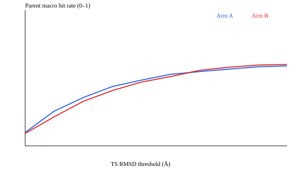

# M0 gate report

**NO-GO**: M_A = 0.5030, M_B = 0.4880, Δ = -0.0150, 95% CI [-0.0670, 0.0326] over 35 test parents.

## Table 1. Primary metric and validity

| Quantity | A (cascade) | B (joint) | Δ = B − A | 95% CI |
|---|---:|---:|---:|---|
| Primary M (δ = 0.5 Å) | 0.5030 | 0.4880 | -0.0150 | [-0.0670, 0.0326] |
| Validity | 0.9293 | 0.9026 | -0.0267 | [-0.0398, -0.0126] |

Per-seed Δ (no bootstrap): seed 0: -0.0380, seed 1: 0.0612, seed 2: -0.0683.

Sensitivity (reported only; the decision stays at δ = 0.5 Å): δ = 0.3 Å → NO-GO, δ = 1.0 Å → INCONCLUSIVE.

## Figure 1. Primary metric versus δ

## Table 2. Secondary metrics (seed-averaged) and capacity

| Metric | A (cascade) | B (joint) |
|---|---:|---:|
| event_recall | 0.5564 | 0.5617 |
| median_rmsd_on_hits | 0.1920 | 0.2236 |
| consistency | 0.9935 | 0.9926 |
| unique_valid_events | 21.3150 | 19.0223 |
| parameters | 960498 | 935970 |

Automorphism cap reached on 0 test reactions. A2x was not run.

## Deviations from the guide

1. Data gate: the owner authorized continuing with unchanged filtering and splits despite 84.58% retention (required >= 85%) and 35 test parents (required >= 40). This limits statistical coverage.
2. Numerical stop: the first formal attempt had non-finite loss in two of three seeds per arm. With owner approval the PaiNN update block of both arms was pre-normalized (layer_norm(s) without affine parameters, per-atom rescaled vectors, zero new parameters), and noise selection and all nine formal runs were redone. Failed runs are retained; see docs/evidence/m0/stabilization_decision.json.
3. CPU pytest needs the repository root on PYTHONPATH.
4. No xTB or DFT validation of generated transition states is claimed.

## Next

Retain negative result and move to direction B.
